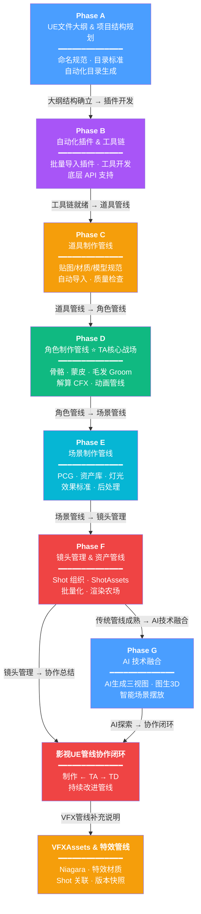
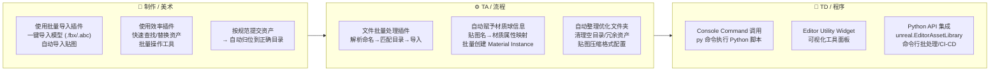
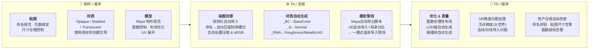
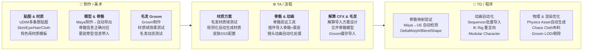
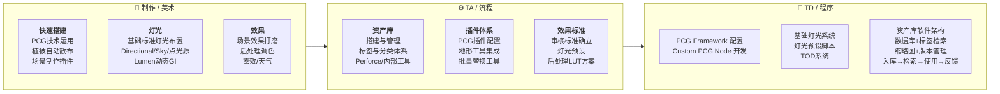
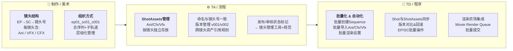
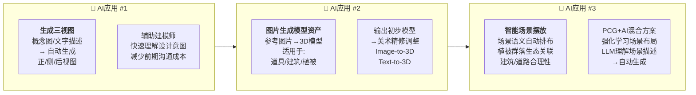
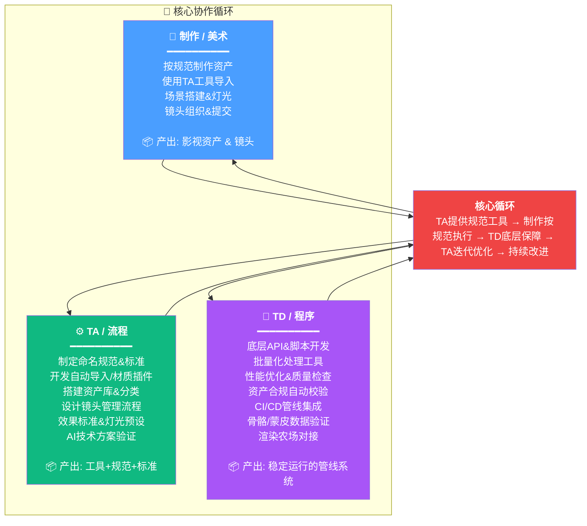
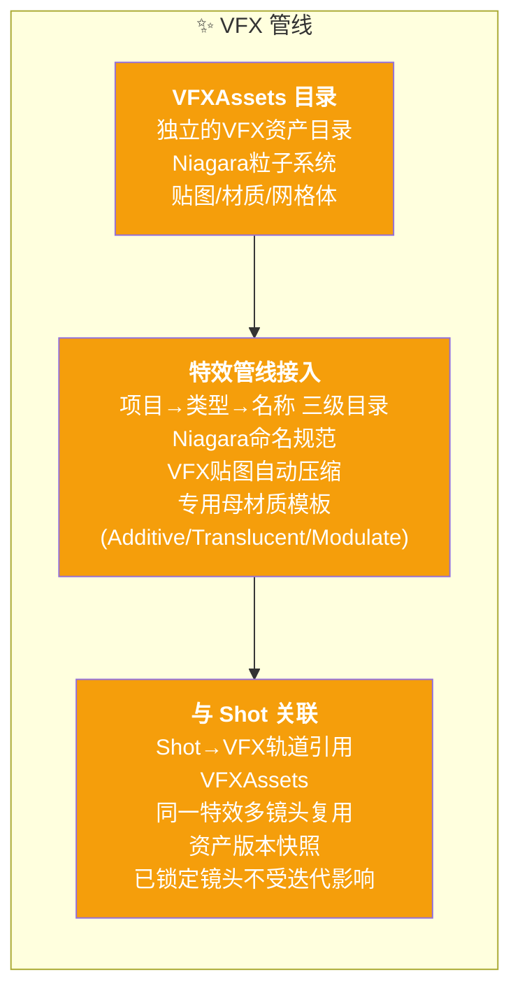
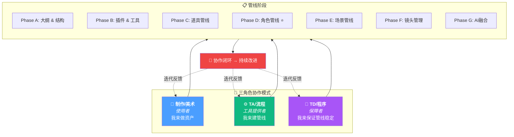

# 影视项目 UE 流程化 — 流程图

> TA · 制作 · TD 协作全景图 | 基于 [[影视项目UE流程化.canvas]]

---

## 一、总览：全流程管线

---

---

## 三、Phase B：自动化插件 & 工具链

---

## 四、Phase C：道具制作管线

---

## 五、Phase D：角色制作管线 ⭐ TA 核心战场

---

## 六、Phase E：场景制作管线

---

## 七、Phase F：镜头管理 & 资产管线

---

## 八、Phase G：AI 技术融合

---

## 九、影视UE管线协作闭环

---

## 十、VFXAssets & 特效管线

---

## 十一、完整协作关系图

---

> [!note] 与 Canvas 的关系
> 本笔记是基于 [[影视项目UE流程化.canvas]] 的 Mermaid 流程图版本。
> Canvas 中的分组结构、文本内容和连线关系均已转换为流程图形式。
>
> - **总览图**：展示 Phase A→G + 协作闭环 + VFX 的完整链路
> - **各 Phase 详图**：展示每个阶段三角色的具体分工
> - **协作闭环**：展示 TA↔制作↔TD 的持续改进循环
