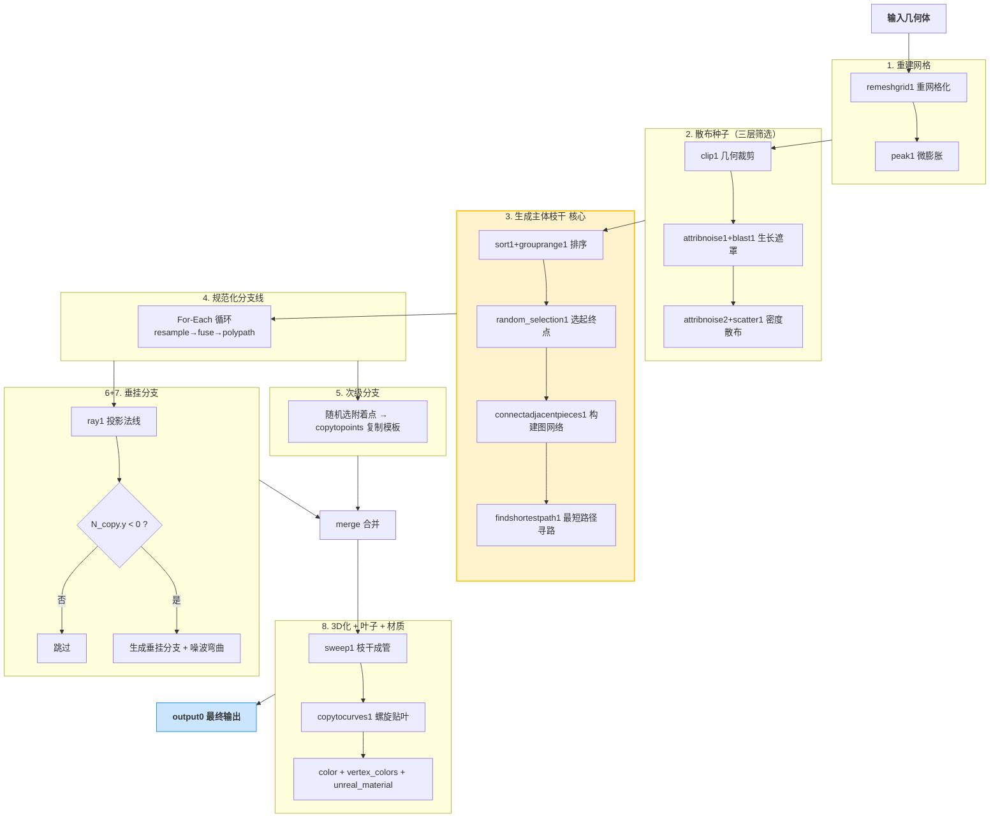

# dd_Ivy 常春藤生成器 — 流程图

> 来源：[[Ivy_技术文档]]

```mermaid
flowchart TD
    A["<b>输入几何体</b>"] --> B

    subgraph S1["1. 重建网格"]
        B["remeshgrid1 重网格化"] --> B2["peak1 微膨胀"]
    end

    S1 --> C

    subgraph S2["2. 散布种子（三层筛选）"]
        C["clip1 几何裁剪"] --> C2["attribnoise1+blast1 生长遮罩"]
        C2 --> C3["attribnoise2+scatter1 密度散布"]
    end

    S2 --> D

    subgraph S3["3. 生成主体枝干 核心"]
        D["sort1+grouprange1 排序"] --> D2["random_selection1 选起终点"]
        D2 --> D3["connectadjacentpieces1 构建图网络"]
        D3 --> D4["findshortestpath1 最短路径寻路"]
    end

    S3 --> E

    subgraph S4["4. 规范化分支线"]
        E["For-Each 循环<br/>resample→fuse→polypath"]
    end

    S4 --> F
    S4 --> G

    subgraph S5["5. 次级分支"]
        F["随机选附着点 → copytopoints 复制模板"]
    end

    subgraph S6["6+7. 垂挂分支"]
        G["ray1 投影法线"] --> G2{"N_copy.y < 0 ?"}
        G2 -->|是| G3["生成垂挂分支 + 噪波弯曲"]
        G2 -->|否| G4["跳过"]
    end

    S5 --> H["merge 合并"]
    S6 --> H

    H --> I

    subgraph S8["8. 3D化 + 叶子 + 材质"]
        I["sweep1 枝干成管"] --> I2["copytocurves1 螺旋贴叶"]
        I2 --> I3["color + vertex_colors + unreal_material"]
    end

    S8 --> OUT["<b>output0 最终输出</b>"]

    style S3 fill:#fff3cd,stroke:#ffc107,stroke-width:2px
    style OUT fill:#cce5ff,stroke:#007bff
```
