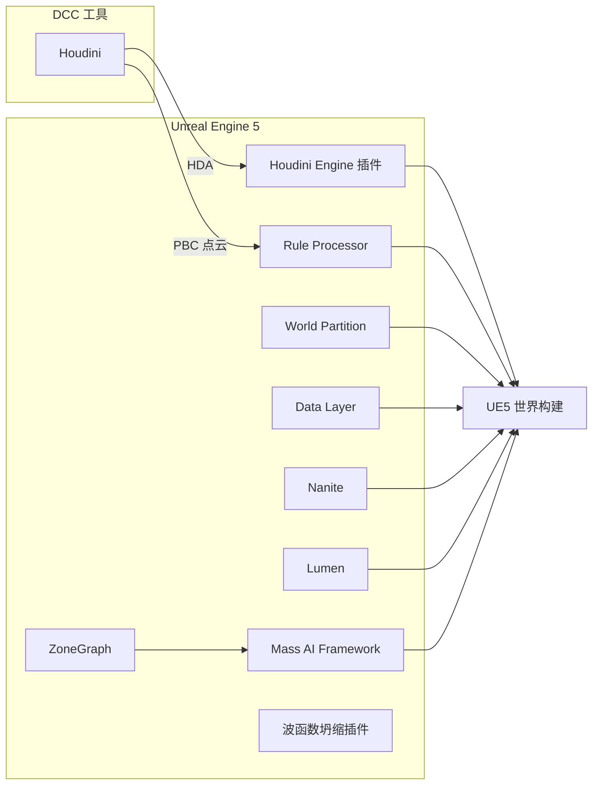

# 黑客帝国：觉醒（The Matrix Awakens）PCG案例研究

## 一、项目概览

《黑客帝国：觉醒》（The Matrix Awakens）是 Epic Games 联合 SideFX 等技术伙伴，基于 **Unreal Engine 5** 打造的技术验证性项目。其核心目标是展示 UE5 在 **超大规模开放世界程序化生成** 方面的能力上限。

### 1.1 核心数据

| 指标 | 数据 |
|------|------|
| 城市面积 | 约 4×5 km（约 20 km²） |
| 街道总长 | 260 km |
| 人行道（带设施） | 512 km |
| 独特建筑 | 7,000+ |
| 行驶车辆（Mass AI） | 18,000 辆 |
| 行人（Mass AI） | 35,000 人 |
| Nanite 实例 | 800 万个 |
| 地面总三角形数 | 1.25 万亿 |
| 建筑模块数量 | 2,000+ |
| 城市全量重新生成耗时 | 约 25-30 分钟（Threadripper PC） |
| 项目期间城市再生次数 | 53 次 |

### 1.2 核心目标

- 充分利用 UE5 的 **Nanite**、**Lumen**、**World Partition** 和 **开放世界** 功能
- 创建一套 **完全程序化** 的城市生成器
- 仅需少量简单输入（基础样条）即可生成美式城市
- 技术与艺术的深度协同：由跨部门多工种联合完成

---

## 二、核心技术栈



### 核心理念：Houdini "工厂"模式

> Houdini 的流程被比作一个"工厂"——节点是执行任务的机器，链接成装配线（HDA），使复杂任务自动化，减少艺术家的重复劳动并实现极高的**扩展性**。

- **节点 = 机器**：每个节点执行特定任务
- **HDA（Houdini Digital Asset）= 工厂**：复杂网络精简为可复用的数字资产，暴露控制项，其余全自动
- **Houdini Engine 插件**：HDA 可直接在 UE 编辑器中使用（现已免费商业许可）
- **SideFX Labs**：提供 200+ 免费开源工具（建模、UV、纹理生成、资产导出等）

---

## 三、资产与内容管线

资产管线处于整个 PCG 流程的 **Pre-City Generation**（城市生成前）和 **Post-City Generation**（城市生成后）两个环节。

### 3.1 美术资产制作规范

**设计三原则：**

1. **它是由什么材料做成的？** —— 建筑材料决定城市风格（花岗岩/砖石等）
2. **它是怎么被制作出来的？** —— 建筑构成逻辑
3. **环境会对它产生什么影响？** —— 天气、光照对建筑表现的影响

**纹理规范：**

| 规范项 | 说明 |
|--------|------|
| 纹理来源 | Megascans 纹理库（可修改特征） |
| 分辨率 | 大部分为 4K |
| 虚拟纹理 | 启用，解决内存中纹理数量限制 |
| 更高分辨率 | 使用 UDIM（UE 自动识别为虚拟纹理） |
| 压缩 | 每种纹理有明确的压缩类型 |
| 世界对齐 | 所有纹理采样考虑世界对齐，真实比例 |
| PBR 校验 | 每类纹理必须验证反照率/金属度/高光在合理区间 |
| UV 策略 | 两套 UV（非烘焙用途，因为 Lumen 全动态照明） |

**标准光照环境：** 在批量资产制作前即确定，严谨的灯光着色验证可减少后期大量修改。

**环境适应：** 材质开发了幕墙水渍、建筑表面污垢等功能并封装为材质函数（需要额外环境 Mask，Megascans 不包含，需单独烘焙）。

**资产导入自动化：** 使用 **AssetIngest Editor Utility** 控件批量自动导入纹理和 FBX，依靠刚性源文件结构自动匹配纹理到材质实例。

### 3.2 建筑模块化设计

**设计流程：**

```
考察 18 种建筑样式 → 提炼共性 → 抽象为 Modules → 适配 Nanite
```

**模块分类体系：**

| 大类 | 子类 | 说明 |
|------|------|------|
| **基础建筑模块** | Corner（拐角） | Base / Interior / Exterior / Split (L/R) / Caps |
| | Wall（墙壁） | 建筑主体墙面 |
| | Entrance（入口） | 建筑入口 |
| **额外模块** | WallCap（墙帽） | 装饰重复墙体模块，区分建筑左右 |
| | Transition（过渡） | 可缩放，填补各类间隙 |
| | Pillar / Column（立柱） | 放置于窗口或墙体之间，不能缩放 |

**模块数量统计：**

| 建筑风格 | 模块数 |
|----------|--------|
| CHD | 72 个 |
| CHC | 226 个 |
| NYA | 485 个 |
| **总计** | **2,000+** |

**关键设计前提：** 该模块划分建立在 Nanite 管线的技术前提下——"我们希望建筑保留尽可能多的细节，因为所有资产走 Nanite 管线，所以可以不在乎面数"。如果去掉 Nanite，则面数、游戏视角和 Culling 策略必须重新权衡。

### 3.3 模块制作工具链

1. **Houdini Module Template Generator**：生成代理模块
2. **Maya**：以代理为起点制作高分辨率几何体
3. **自定义导入器**：批量导入模块，创建文件夹结构，为每个模块创建材质实例
4. **形状语法（Shape Grammar）**：描述墙面的构造方法，一种表达式语言

### 3.4 建筑道具挂件（Props）

在模块上**手动添加道具锚点**用于挂载装饰物，道具按类型分为：

- 雨篷
- 灯具
- 路牌
- 招牌

道具被注册到模块并分组，在城市程序化生成过程中**随机选取**。元数据由 Houdini Template Generator 生成并存储，Houdini Engine 将模块的 Attributes 转换为 Tags 存储到静态网格对象上。

**枢轴点规范：** 设定在 Module 的左侧和正面外墙的边线对齐，确保建筑对齐。

**建筑风格封装：** 风格信息记录在 **BDF（Building Definition Files）** 中，代表构建某种建筑风格需要的所有内容。

### 3.5 建筑窗户系统

窗户由单独材质表现，使用 **Interior Mapping** 机制：

- 房间数据打包为 **32 位无符号整型** 传送给 Houdini 和 UE 插件
- 所有材质需要的信息都有标志，方便识别什么类型的房间需要渲染窗户
- 数据存储为每个建筑 ISM 实例的自定义数据，在材质中使用

### 3.6 主建筑与群落（Biomes）

使用 UE5 的 **Level Instance Packed Blueprints（关卡实例打包蓝图）** 创建城市中的所有群落、主建筑和主区域：

- 基于任意选定的 Actor 创建，Actor 被导出到新关卡
- 所有 Actor 转成 **ISM 组件** 包含在打包蓝图中
- 可放置在关卡中后再编辑
- 这些主建筑和群落也会送入 City Generator 参与程序化内容生成

---

## 四、程序化生成管线（核心）

### 4.1 整体架构：三阶段流水线

```
城市基础 (City Base)  →  城市核心 (City Core)  →  场景布置 (Set Dressing)
```

这决定了在特定阶段改变规则时需要在何处重新生成城市。

### 4.2 City Layout（城市布局）—— 阶段一

**HDA 节点：** City Layout，4 个输入：

| 输入 | 说明 |
|------|------|
| City Shape（城市形状） | 由 Curve 节点手动圈出 |
| Arteries（主干道） | 由 Curve 节点提供 |
| City Zones（城区） | 定义商业区、居民区等 |
| Removal Inputs（移除输出） | 排除区域 |

**核心技术：**
- 使用 Houdini **最短路径节点** 构建干线
- 工具自动计算最合适的网格模式匹配用户输入
- 本质上是城市的 **垂直建模工具**

**输出元数据：**
- 路网定义
- 地段定义
- 人行道网络
- 道路连通性
- 交通密度
- 行人密度

**为什么不使用 OpenStreetMap？**
- 数据不规则，地区大小和形状独一无二
- 转化和调整工作量大，会产生过多特殊资产
- 创建巨型城市网格体在目标细节程度下不可行

**替代方案：量化世界** — 创建自己的建筑模块来构建世界，尽可能依赖**实例化**，完全控制城市几何体。

### 4.3 City Processor（城市处理器）—— 阶段二

**依赖图（从上到下）：**

```
City Layout（基础）
    ↓
Roads（道路） + FreeWay（高速路） + Lots（城区地块） + Sidewalks（人行道）
    ↓
Traffic（交通系统） + Buildings（建筑） + Ground（地块）
    ↓
StreetFurniture（街道组件） + Decals（贴花系统） + Audio（卷积混响）
```

**HDA 输入（4 个）：**

| 输入 | 说明 |
|------|------|
| City Layout | 承接上一阶段 |
| FreeWay | 高速公路 |
| Hero Buildings | 地标建筑 |
| Height Override | 天际线覆盖 |

#### 4.3.1 道路生成（Road Generation）

**三级道路层级：**

| 类型 | 宽度 | 作用 |
|------|------|------|
| Arterial（主干道） | 20m 模块 | 遵循最短路径原则 |
| Collector（区域贯穿道路） | 10m 模块 | 连接主干道与局部道路 |
| Local（局部街道） | 5m 模块 | 街区内部道路 |

**处理流程：**
1. 根据道路连接角度精确切割每个路段
2. 为交叉路口留出空间
3. 用 9 种基础砖块填充道路几何体
4. 替换为高分辨率对应模块
5. 输出点云用于在 UE 中实例化

**道路模块特征：**
- 两组 UV
- 储存为顶点颜色的相对顶点位置
- 边缘楔形设计（平滑连接）
- 一定弯曲度（增加逼真感）
- 程序化刷上顶点色供材质使用

**HDA 输出（6 个）：** ROAD_NETWORK_INSTANCE / POINT_CLOUD / CITY_LANES / TRAFFIC_DATA / ROAD_MODULES_PACKED / ROAD_FILLERS

**道路细节处理：** 额外的 `Road_detailing` SubNetwork 为道路添加细节。

#### 4.3.2 高速路生成（Freeway Generation）

**特点：**
- 追逐场景的核心场地
- 有机的、触手状外观
- 2 个闭环 + 1 个悬垂通道 + 55 个入口匝道
- 可用高速路总长 **25 km**

**技术方案（与普通道路的关键区别）：**

> 高速路没办法完全基于模块的实例化完成。路面必须程序化生成为一个大型网格体（Mega Mesh），之后切分为 100m 的小型网格块以适配流送。

- 路障、柱子、标牌、杂物等为 Nanite 实例
- 由多个部门反复调整以获得完美的追逐路线
- 设计曲线从 UE 导回 Houdini 参与 City Layout 和 City Processor

**HDA：** "Freeway Master"，5 个输入 / 4 个输出。

#### 4.3.3 地块处理（City Lots Processor）

**处理流程：**

```
移除高速路占地区域 → 多层几何体清理过滤 → 算法细分（权衡建筑高度 vs 可用表面）
→ 低层建筑自动划分为纽约风格交错式地块
```

**Building DNA 系统：**

每幢建筑用自定义 DNA 描述：

| DNA 属性 | 说明 |
|----------|------|
| FootPrint（建筑足迹） | 17 种预定义形状（横截面） |
| 高度范围 | 垂直方向分三层：底层、中间层、屋顶层 |
| 造型选项 | 方顶 (Cubified) 或交错式 (Staggered) |
| BDF（建筑风格） | 控制第一层（最下层）的建筑风格和 Props |

**FootPrint（17 种）：** 意味着地块上可以撒布 17 种横截面的高层建筑，加上高度差异随机化、BDF 和 Shape Grammar，理论上可实现**无数种建筑造型**。

**Building Volume（建筑体积）：** 全局控制，允许用户引入随机控制城市的整体错落程度。

#### 4.3.4 地面与人行道（Ground & Sidewalk）

**人行道（City Sidewalk Processor HDA）：**
- 利用 City Layout 提供的人行道样条网格和地块定义
- 自适应散布模块
- 分别处理外角和内角（内角使用非均匀缩放）

**地面：**
- 减去建筑覆盖区域
- 预替换 Megascan 地面 + 位移贴图
- 每块地砖多达 **50 万三角形**
- 地砖被重复利用 **250 万次**
- 仅地面就有 **1.25 万亿三角形**

#### 4.3.5 场景布置（Set Dressing）— 阶段三

**三种区域类型（Zone Types）：**

| 类型 | 说明 |
|------|------|
| Plaza | 商场地面 |
| Freeway | 高速公路下方地面 |
| Parking | 停车场地面 |

**生态群落（Biomes）：** 预组装好的资产包，使用 Level Instance Packed Blueprint 工作流。

**填料散布器（Packing Scatterer）：**
- 测量每块区域的最长边作为方向参照
- 以最佳方式组合生物群落
- 确保实例不会相互重叠
- 广泛应用于整个城市图（包括建筑屋顶）

**街道家具（Street Furniture）— City Street Furniture Processor HDA：**

| 类型 | 说明 |
|------|------|
| Bus Stop | 巴士站台 |
| Fire Hydrant | 消防栓 |
| Parking Signage | 停车牌 |
| Street Lamp | 路灯 |
| Trash and Letter Box | 垃圾桶和信箱 |
| Traffic Light | 交通灯 |
| Border Wall | 边境墙 |
| Plers Biomes | 普勒斯生物群系 |

#### 4.3.6 道路贴花（Road Decals）

City Decals HDA — 道路细节主要由贴花贡献：

- **大型图块贴花：** 人行横道、轮胎印记等，使用 Mega Mesh 方案投射到道路几何体
- **小型贴花：** 独立分散
- **包含元素：** 交叉路口标记、双黄线、白虚线、右转车道分离线、停车标记线、方向箭头、轮胎标记、井盖、喷漆、斑马线、出租车待客区、公交车待客区

#### 4.3.7 音频生成（Audio Generation）

- 在城市表面覆盖 **3m 密度点云**
- 储存元数据：混响量、音效类型等
- 利用城市代理几何体的环境遮蔽
- 基于 UE5 卷积混响功能，划分 15 种不同声音指标

#### 4.3.8 City Stats（统计功能）

City Processor 提供 Stats 功能，量化展示城市信息，用于：
- 指引用户设计出更符合期望的结果
- 修复漏洞
- 添加细节

---

## 五、建筑生成系统（Building Generator）深度解析

### 5.1 原型开发与迭代

- 使用 Houdini + Houdini Engine 在 UE5 内完成创意型工作
- **Building Module Template Generator**：按需快速创建特定大小的建筑模块代理
- 需要 **建筑形状语法系统** 使建筑生成尽可能随机化

### 5.2 建筑定义文件（BDF）

```
原型设计 → JSON 文件（建筑定义文件）→ BDF 封装建筑风格
```

**数据流转：**

```
BDF 层级字典 → 计算楼层间距 → 切割体积划分楼层 → 获取楼层切片
→ 逐层计算 Corner 类型 → 生成模块和拐角点云（考虑遮挡关系）
→ 建筑 Props（由建筑 ID 和地块 ID 共同决定）→ 输出点云 + 屋顶几何体
```

### 5.3 形状语法（Shape Grammar）

一种表达式语言，用于描述墙面的构造方法：

| 符号 | 含义 |
|------|------|
| `\|` | 模块桶，定义模块放置行为 |
| 字母 (A-Z) | 字典键，查找模块元数据（宽度、高度） |
| `( )` | 无限可重复宏模式 |
| `[ ]` | 固定重复宏模式 |
| `*` | 桶中所有模块可缩放匹配建筑立面长度 |

**选择逻辑：** 完整迭代一次总长度最接近建筑立面长度，衔接缝隙最小且不超过建筑立面长度。

**设计意图：** 定义哪些楼层可重复使用、哪些部分可以分成不同风格、如何放置顶部模块完成墙体。

### 5.4 模块遮挡剔除

- 连接建筑墙体上的被遮挡模块需要移除
- 使用布尔包壳 (Boolean Shell) 代表接触墙高度
- 每个模块的额外采样点用于相交测试
- 即使保守处理，仍然实现了约 **25% 的模块/道具/贴花减少**

### 5.5 窗户处理系统

| 组件 | 说明 |
|------|------|
| 窗户立方体贴图 | 在每个模块立面构建连接性数组 → 确定可放置房间的最大尺寸 → 按楼层 ID → 房间 ID → 房间大小逐级点亮灯光 |
| 窗户处理 | 1 层模块添加窗户辅助对象，定义窗户表面数据 |
| 窗户标记 | 利用建筑入口位置，在最近窗户放置标记（霓虹灯招牌等） |

### 5.6 屋顶生成与波函数坍缩（WFC）

**屋顶生成：**
- 所有屋顶几何体来自输入建筑体积
- UV 生成和缩放控制
- 分割式屋顶支持（处理复杂方形体积）
- 推拉插入物函数隐藏间隙

**波函数坍缩（Wave Function Collapse）应用：**

| 指标 | 数据 |
|------|------|
| 独特屋顶结构 | 2,600+ |
| WFC 模型约束数 | 5,000+ |
| 可平铺网格体 | 仅 33 个 |

**算法流程：**

```
初始化 → 观察（选择最小熵图块，随机选择选项）→ 传播（递归调整相邻图块域）→ 重复直到全部坍缩
```

**核心概念：**
- **约束 (Constraint)**：键选项 + 邻接方向 + 邻接选项
- **空白选项 (Empty)**：确保网格边界不会形成开放式求解
- **熵 (Entropy)**：图块剩余选项数量

**Epic 实现特点：**
- 从任意布局中**直观地创建** WFC 模型（而非基于标签）
- 使用网格 Actor 蓝图直观显示边界框
- 可根据网格中的静态网格体 Actor 获取起始选项
- **美术方向 + 程序主义** 的结合
- WFC 插件由 Epic 特殊项目团队制作，之后作为 UE5 实验性插件提供

### 5.7 Volume Override（体积覆盖）

项目后期精细调整工具：

- 降低特定高度范围的城市景观高度（避免蝴蝶效应）
- 锁定有问题的特定建筑体积
- 支持多重 BDF 体积，隐藏建筑风格过渡

---

## 六、UE5 引擎内集成

### 6.1 Rule Processor（规则处理器）

> 随 CitySample Release 的**项目插件**（非引擎内部插件），通过 Alembic 导入点云数据（PBC）。

**核心功能：**
- 点云可来自任何 DCC 工具（本项目中为 Houdini）
- 规则可简单（每个点生成一个 Actor）或复杂（多套规则组织）
- 智能回收：追踪 Actor，自动清理旧规则下的 Actor
- 元数据处理：查看关键值，将数据作为 Actor 的属性覆盖

**城市构成包含：** 建筑 / 街道 / 贴花 / 人群和车辆 / 声音

### 6.2 World Partition & OFPA

- **World Partition**：编辑器/运行时动态加载对象
- **OFPA（One File Per Actor）**：加载/卸载粒度精细化到 Actor 层级，Actor 与关卡解耦
- **Data Layer**：Actor 按标签分层管理（编辑器层 / 运行时层）

### 6.3 HLOD 策略

| 层级 | 范围 | 说明 |
|------|------|------|
| Main Grid | 0-128m | 所有资产（玩家近距离） |
| HLOD0 | 128-768m | 每个 Grid Cell 含 4 个 HLOD0 Actor（整合到 ISM 组件） |
| HLOD1 | >768m | 始终加载，单元内所有静态网格合并为一个 Nanite 网格（构成天际线/远景） |

- HLOD0 随 Main Grid 修改而更新，频率：**自动化流程每晚生成一次**
- 程序化建筑和手动制作建筑都使用 ISM 组件减少 Actor 总数

### 6.4 碰撞体策略

| 建筑部位 | 策略 |
|----------|------|
| 下半部分 | 精确到模块的碰撞体（玩家可靠近内陷部分、走过天顶过道和走廊） |
| 上半部分 | 简并碰撞 → 独立基本碰撞对象代表整片区域 → 单独 Actor 放置 |

### 6.5 光线追踪分组

- 每个对象建立光追分组，优化 Lumen 的 Surface Cache
- 原则：避免稀疏对象、避免网格体重叠过多

### 6.6 BugItGo 调试工作流

往返传输调试流程：

```
UE 编辑器命令行 BugIt 截取 POI → BugItGo 字符串粘贴到 Houdini
→ 在 Houdini 世界场景生成指示符 → 定位边缘案例 → 逐步调试 → 烟雾测试
```

**体积过滤器 HDA：** 按目标体积集合输入建筑生成器，无需加载整座城市即可烟雾测试，大幅提高迭代速度。

---

## 七、Mass AI：为城市赋予生命力

### 7.1 Mass Framework 架构

**三层插件体系：**

```
MassEntity（数据导向基础框架）
    ↓
MassGameplay（将实体带入游戏世界）
    ↓
MassAI（导航、动画、行为）
```

**MassEntity 设计哲学：**

| 传统 Actor-Component | Mass Framework |
|----------------------|----------------|
| 代码和数据不连贯（顺序更新） | **片段 (Fragment)**：小型数据结构 |
| 组件在内存中不保证连续 | 类似构成的实体片段**连续储存** |
| 访问导致高速缓存缺失 | 减少缓存缺失，简化并发执行 |
| 组件可能臃肿 | 实体不含指向不需要数据的指针 |

**关键组件：**
- **实体查询 (Entity Query)**：过滤需要执行逻辑的实体
- **处理器 (Processor)**：批量更新发生的地方

### 7.2 ZoneGraph（区域图）

- 轻量级设计驱动型 AI 工作流
- **替代传统 AI 导航网格体（Nav Mesh）**
- 逐点廊道结构 + 交叉点连接的生态系统
- 存储可操作标签（静态：行人/交通道识别；动态：开放/封闭车道）
- 源自 Houdini 中提取的道路元数据

### 7.3 人群系统（Crowd System）

**规模：** 35,000 名行人

**数据驱动：** 合并行人密度程序数据 + 人行道网络 → 互联的 ZoneGraph

**StateTree（状态机）：**
- 可扩展的通用型状态机，决策树结构呈现
- 行人状态：漫步、闲逛、奔跑等
- 自上而下评估入口条件，运行参数化任务
- 与 Mass Framework 内存高效融合

**动画特性：**
- 多种走路风格和速度
- 平滑开始和停止动画
- 头部朝向 + 上半身方向（独立于速度）
- 对玩家和其他行人做出反应
- 基于力的避让机制（处理动态和静态障碍）
- 身体碰撞响应（播放一次性动画后恢复行为）

**LOD 系统：**

| LOD 级别 | 数量上限 | 描述 |
|----------|---------|------|
| 高 (LOD0) | 10 | 完整 MetaHuman Actor，带面部动画 |
| 中 (LOD1) | 20 | 完整 MetaHuman Actor，减少面部动画 |
| 低 (LOD2) | 500 | 轻量级顶点动画网格体 |
| 不可见 | 其余 | 不渲染 |

**持久性：** 无论 LOD 如何切换，始终保持当前行为，走远了再回来还能找到同一个角色。

### 7.4 交通系统（Traffic System）

**规模：** 18,000 辆行驶车辆 + 额外停车车辆

**核心行为（Mass Processor 编程）：**
- 沿车道陆续前进
- 十字路口等待
- 沿车道排列（队列机制）
- 根据前车距离调整车速
- 障碍物响应（玩家、车祸场景）
- 车道变更与合并（检测邻近空车道 → 创建幽灵实体 → 变道）

**LOD 系统：**

| LOD 级别 | 数量上限 | 描述 |
|----------|---------|------|
| 高 (LOD0) | 10 | 完整物理车辆 Actor，可形变、销毁、交互 |
| 中 (LOD1) | 150 | 运行物理效果，简化悬架 |
| 低 (LOD2) | 5,000 | 实例化静态网格体，简单曲线和位置更新 |
| 不可见 | 其余 | 不渲染 |

**停放的车辆：** 通过点云在每个位置直接生成，每辆都可被玩家乘坐、驾驶、丢弃、重新驾驶。

### 7.5 交叉口协调器（Intersection Coordinator）

- 管理车道开放/关闭时机
- 控制行人通行、车辆转弯
- 管理人流和车流密度（防止市中心人口逐渐变少）
- 大量交叉口配置增加了复杂性

---

## 八、完整数据管线总览

```
                          ┌─────────────────────────────────┐
                          │     Pre-City Generation          │
                          │  资产制作 · 模块化 · BDF定义      │
                          └──────────────┬──────────────────┘
                                         │
                                         ▼
┌─────────────────────────────────────────────────────────────────────┐
│                        City Generation（Houdini）                     │
│                                                                     │
│  City Layout → Road Processor → Freeway Master → Lot Processor      │
│       ↓              ↓                ↓                ↓            │
│       └──────────────┴────────────────┴────────────────┘            │
│                                    ↓                                │
│              Building Generator + Ground + Sidewalk                  │
│              Street Furniture + Decals + Audio                       │
│                                    ↓                                │
│                        PBC 点云导出（Alembic）                        │
└─────────────────────────────────┬───────────────────────────────────┘
                                  │
                                  ▼
┌─────────────────────────────────────────────────────────────────────┐
│                     Post-City Generation（UE5）                       │
│                                                                     │
│  Rule Processor → World Partition → HLOD → Collision → RT Grouping  │
│       ↓                                                             │
│  Mass AI Framework（ZoneGraph → Crowd + Traffic）                    │
└─────────────────────────────────────────────────────────────────────┘
```

---

## 九、关键技术决策与设计哲学

### 9.1 量化世界 vs 真实世界数据

> "我们要做的是量化世界，创造自己的建筑模块来构建世界，然后尽可能依赖实例化。"

- **放弃 OSM 真实数据**：不规则 → 过多特殊资产 → 不可行
- **选择程序化生成**：模块化 + 实例化 + 完全可控

### 9.2 Nanite 带来的新挑战

| 优势 | 新瓶颈 |
|------|--------|
| 1 m² 可容纳 100 万三角形 | 磁盘上资产大小和数量成为限制 |
| 16 km² 可达 16 万亿三角形 | 需要巧妙切割世界 |

### 9.3 程序化与艺术控制的平衡

- **Building DNA** = 程序化 + 参数化（17 种足迹 × 3 层高度 × BDF 风格）
- **Shape Grammar** = 美术可控的立面生成
- **WFC 屋顶** = 33 个网格体 → 5,000+ 约束 → 2,600+ 结构（美术方向 + 程序主义）
- **Volume Override** = 后期精细调整（锁定特定体积，避免蝴蝶效应）
- **Biomes** = 预组装的艺术资产包 + 程序化散布

### 9.4 迭代哲学

> "在项目的制作过程中，这个城市被反复生成了 53 次。每一次生成，我们都会雕刻城市，探索值得改进的程序规则，修复漏洞，添加细节，最后再重新生成城市。"

- 不追求一次性完美设计
- 每次全量生成约 25 分钟 → 数小时内完成最终版本 → 理论上每日可创建多个版本
- **BugItGo** 工作流确保快速定位问题

---

## 十、经验总结与启示

### 10.1 技术方法论

1. **管线思维 > 单点工具**：Houdini 的工厂模式（节点→网络→HDA→引擎集成）
2. **量化世界是前提**：程序化生成必须先完成抽象和解构
3. **实例化是一切**：800 万 Nanite 实例，250 万地砖实例——实例化是规模化唯一出路
4. **点云是通用语言**：Houdini 导出 PBC → Rule Processor 引擎内重建，DCC 与引擎解耦
5. **Nanite 解放了几何预算**：但从多边形瓶颈转移到了磁盘大小和数量瓶颈
6. **数据驱动 > 蓝图硬编码**：Mass AI 用 Fragment + Processor 模式替代传统 Actor-Component

### 10.2 流程方法论

1. **先定标准，后批量生产**：标准光照环境 → PBR 校验 → 制作规范 → 自动化导入
2. **原型快速迭代**：Houdini Engine 在 UE 内直接原型开发
3. **往返工作流**：UE 设计曲线 → 导出到 Houdini 生成 → 导回 UE，非单向流程
4. **统计驱动决策**：City Stats 量化生成结果，指导优化方向

### 10.3 组织方法论

1. **跨部门协同**：美术/设计/程序/过场动画多个部门反复调整
2. **工具为美术服务**：Shape Grammar、Volume Override 等降低美术使用程序化工具的门槛
3. **"既要又要"不可行**：程序化生成与高度定制化存在本质矛盾，需要设计层面的取舍

---

## 十一、参考资料

### 官方资源
- [City Sample 官方文档](https://dev.epicgames.com/documentation/unreal-engine/city-sample-project-unreal-engine-demonstration)
- [City Sample（Fab 免费下载）](https://www.fab.com/listings/4898e707-7855-404b-af0e-a505ee690e68)
- [Houdini 城市生成快速开始](https://dev.epicgames.com/documentation/en-us/unreal-engine/city-sample-quick-start-for-generating-a-city-and-freeway-using-houdini)

### 官方演讲
- [The Matrix Awakens: Generating a World | State of Unreal 2022](https://www.youtube.com/watch?v=usJrcwN6T4I) — **核心技术演讲**
- [The Matrix Awakens: Creating a World](https://www.youtube.com/watch?v=xLVJP-o0g28) — UE5 世界搭建
- [State of Unreal 2022 完整大会](https://www.youtube.com/watch?v=JH21g5Ubd3U)

### 技术分析
- [80 Level: Breakdown — Creating The Matrix Awakens in Houdini & UE5](https://80.lv/articles/breakdown-creating-the-matrix-awakens-in-houdini-unreal-engine-5)
- [David Inlines: The World of Matrix UE5 + Houdini](https://inlav.net/1770/)

### 学术研究
- [MatrixCity (ICCV 2023): A Large-scale City Dataset for City-scale Neural Rendering](https://arxiv.org/abs/2309.16553) — 基于 City Sample 的大规模城市数据集
- Interactive Procedural Street Modeling（SIGGRAPH 2008）
- Tensor Field Design for Street Networks
- Procedural Modeling of Cities（Parish & Müller）

### 开发者作品
- [Bastian Hoppe - Matrix Awakens (ArtStation)](https://fatrobot.artstation.com/projects/Pen5PL)
- [Zoë Lord - Material & Procedural Texture (ArtStation)](https://zolord.artstation.com/projects/3qZYPm)
- [Wenyi Zhang - Procedural City Generator](https://www.wenyizhang.com/projects/procedural-city-generator)

### 学习课程
- [CGtuto: Houdini UE5 程序化城市构建](https://cgtuto.com/archives/15833)
- [UnrealCircle: 模块化的城市生成 | Epic Games 肖月](https://www.bilibili.com/video/BV1rT41177Qw)
