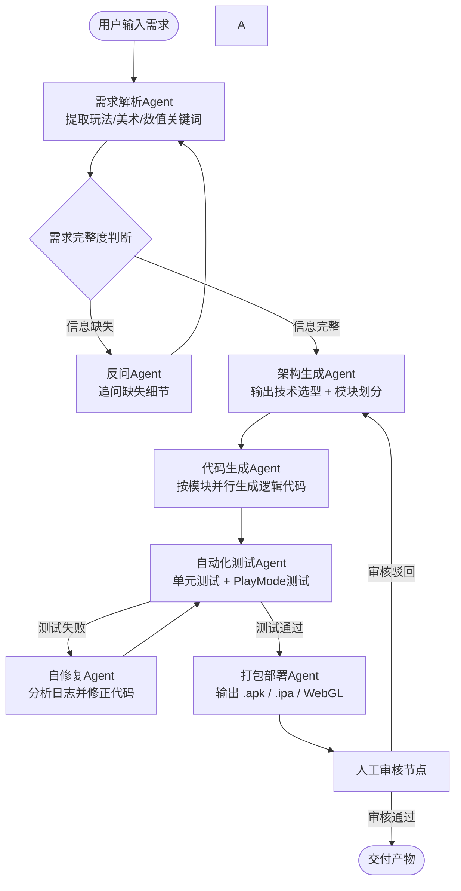

```mermaid
flowchart TB
    Start(["用户输入需求"])
    Parser["需求解析Agent<br/>提取玩法/美术/数值关键词"]
    Decision{"需求完整度判断"}
    Ask["反问Agent<br/>追问缺失细节"]
    Arch["架构生成Agent<br/>输出技术选型 + 模块划分"]
    Code["代码生成Agent<br/>按模块并行生成逻辑代码"]
    Test["自动化测试Agent<br/>单元测试 + PlayMode测试"]
    BugFix["自修复Agent<br/>分析日志并修正代码"]
    Package["打包部署Agent<br/>输出 .apk / .ipa / WebGL"]
    Review["人工审核节点"]
    End(["交付产物"])
    A["A"]
    Start --> Parser
    Parser --> Decision
    Decision -->|"信息缺失"| Ask
    Ask --> Parser
    Decision -->|"信息完整"| Arch
    Arch --> Code
    Code --> Test
    Test -->|"测试失败"| BugFix
    BugFix --> Test
    Test -->|"测试通过"| Package
    Package --> Review
    Review -->|"审核通过"| End
    Review -->|"审核驳回"| Arch
    %% mermaid-flow:pos Start=234,82 Parser=234,184 Decision=334,300 Ask=124,416 Arch=344,416 Code=273,526 Test=273,636 BugFix=263,746 Package=657,686 Review=486,848 End=486,942 A=617,518
```
