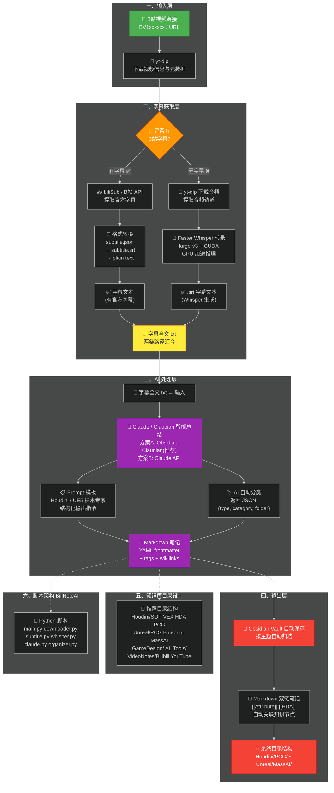

# AI 视频知识库自动化流水线

```mermaid
%%{init: {"theme":"dark"}}%%
flowchart TB
    subgraph INPUT ["一、输入层"]
        A["📎 B站视频链接\nBV1xxxxxx / URL"]
        B["🔧 yt-dlp\n下载视频信息与元数据"]
    end
    subgraph SUBTITLE ["二、字幕获取层"]
        C{"🔀 是否有\nB站字幕?"}
        D["📥 biliSub / B站 API\n提取官方字幕"]
        E["🔄 格式转换\nsubtitle.json\n→ subtitle.srt\n→ plain text"]
        F["✅ 字幕文本\n(有官方字幕)"]
        G["🎵 yt-dlp 下载音频\n提取音频轨道"]
        H["🧠 Faster Whisper 转录\nlarge-v3 + CUDA\nGPU 加速推理"]
        I["✅ .srt 字幕文本\n(Whisper 生成)"]
        J["📄 字幕全文 txt\n两条路径汇合"]
    end
    subgraph AI ["三、AI 处理层"]
        K["📄 字幕全文 txt → 输入"]
        L["🤖 Claude / Claudian 智能总结\n方案A: Obsidian Claudian(推荐)\n方案B: Claude API"]
        M["📋 Prompt 模板\nHoudini / UE5 技术专家\n结构化输出指令"]
        N["🏷️ AI 自动分类\n返回 JSON:\n{type, category, folder}"]
        O["📝 Markdown 笔记\nYAML frontmatter\n+ tags + wikilinks"]
    end
    subgraph OUTPUT ["四、输出层"]
        P["📂 Obsidian Vault 自动保存\n按主题自动归档"]
        Q["🔗 Markdown 双链笔记\n[[Attribute]] [[HDA]]\n自动关联知识节点"]
        R["📁 最终目录结构\nHoudini/PCG/ • Unreal/MassAI/"]
    end
    subgraph STRUCTURE ["五、知识库目录设计"]
        S["📂 推荐目录结构\nHoudini/SOP VEX HDA PCG\nUnreal/PCG Blueprint MassAI\nGameDesign/ AI_Tools/\nVideoNotes/Bilibili YouTube"]
    end
    subgraph SCRIPT ["六、脚本架构 BiliNoteAI"]
        T["🐍 Python 脚本\nmain.py downloader.py\nsubtitle.py whisper.py\nclaude.py organizer.py"]
    end
    A --> B
    B --> C
    C -->|"有字幕 ✅"| D
    D --> E
    E --> F
    C -->|"无字幕 ❌"| G
    G --> H
    H --> I
    F --> J
    I --> J
    J --> K
    K --> L
    L --> M
    L --> N
    M --> O
    N --> O
    O --> P
    P --> Q
    Q --> R
    O -.-> S
    O -.-> T
    style A fill:#4caf50,stroke:#2e7d32,color:#fff
    style C fill:#ff9800,stroke:#e65100,color:#fff
    style J fill:#ffeb3b,stroke:#f9a825,color:#333
    style L fill:#9c27b0,stroke:#6a1b9a,color:#fff
    style O fill:#9c27b0,stroke:#6a1b9a,color:#fff
    style P fill:#f44336,stroke:#b71c1c,color:#fff
    style R fill:#f44336,stroke:#b71c1c,color:#fff
    direction LR
    %% mermaid-flow:pos A=1130,107 B=1130,226 C=1130,384 D=1139,492 E=1139,586 F=1139,680 G=642,492 H=642,586 I=642,680 J=1130,799 K=1130,943 L=1130,1037 M=1642,1131 N=535,1131 O=1130,1225 P=2257,977 Q=2257,1096 R=2257,1190 S=1349,1369 T=433,1369
```
