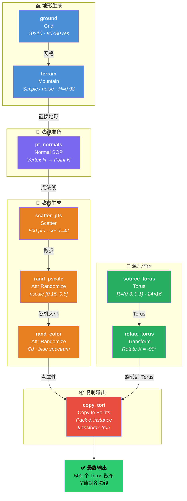
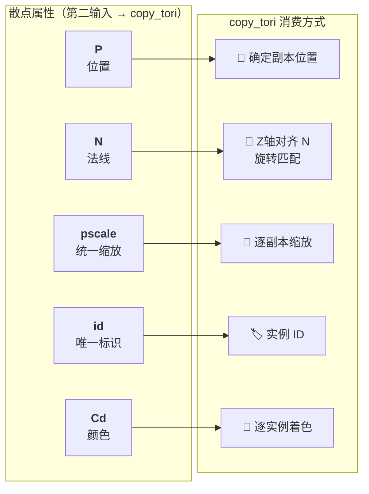
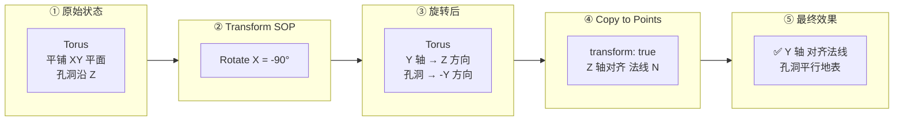

# Houdini 散布系统 — 流程图

> **项目文件**: `D:/TA/Houdini/mcp/MCP.hip`
> **网络路径**: `/obj/scatter_system`

---

## 1. 完整节点管线

---

## 2. 属性数据流

散点属性如何被 Copy to Points 消费：

---

## 3. Y 轴对齐法线原理

Copy to Points 默认将源几何体 **Z 轴** 对齐法线。Torus 的孔洞沿 Z 轴，需旋转 -90°（X 轴），使 Y 轴换到 Z 方向。

| 源 Torus 轴 | 旋转后方向 | Copy to Points 映射 |
|:-----------:|:---------:|:------------------:|
| Y 轴 | → Z | → 法线 N ✓ |
| Z 轴（孔洞） | → -Y | → 垂直于法线 |

---

## 4. 管线小结

| # | 节点 | 类型 | 一句话 |
|---|------|------|--------|
| 1 | ground | Grid | 10×10 地面网格 |
| 2 | terrain | Mountain | Simplex 噪声置换 |
| 3 | pt_normals | Normal | 顶点法线 → 点法线 |
| 4 | scatter_pts | Scatter | 500 散点 + pscale/id |
| 5 | rand_pscale | Attr Randomize | pscale 随机 [0.15, 0.8] |
| 6 | rand_color | Attr Randomize | Cd 随机蓝色系 |
| 7 | source_torus | Torus | 源圆环 R=(0.3, 0.1) |
| 8 | rotate_torus | Transform | 旋转 -90° X |
| 9 | copy_tori | Copy to Points | Pack&Instance 输出 |
