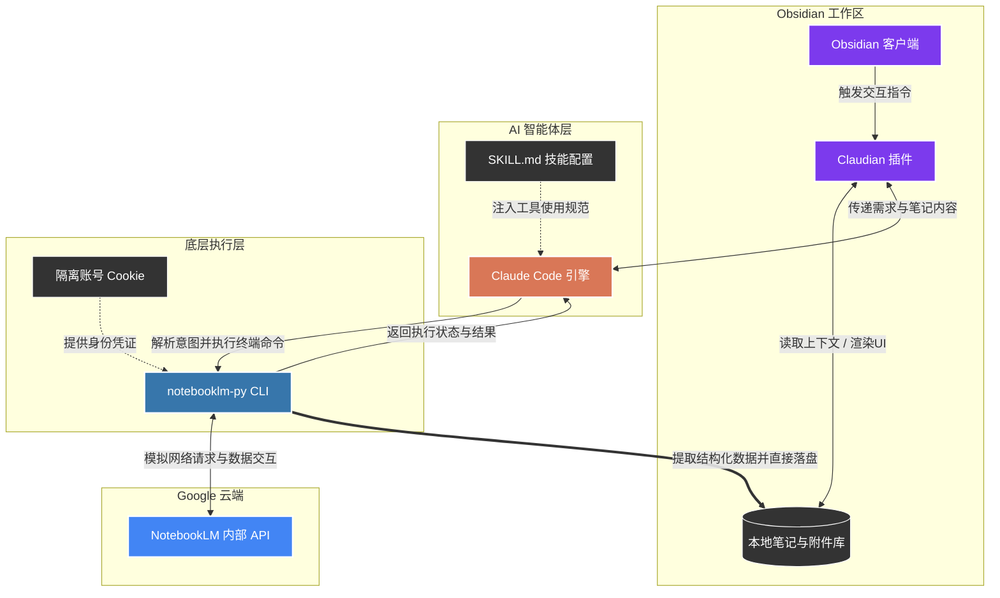

## 核心目标
NotebookLM 是最强大的 AI 知识库工具，能完美弥补 Obsidian 的AI知识库功能。
但 NotebookLM 是网页端工具，且**无法编辑，资料无法回填到Obsidian，使用起来割裂感很强**。

使用 Claude Code + notebooklm-py 能够完美将 Obsidian 与 NotebookLM 融合。


## 核心工具

- [ ] Claude Code
- [ ] Obsidian
- [ ] Claudian 插件
- [ ] notebooklm-py




#### 安装智能体工具

```bash
# 安装OpenCode
npm install -g opencode-ai  
# 验证  
opencode --version

# 安装Claude Code
npm install -g @anthropic-ai/claude-code
# 如果有claude账号，则登录  
claude login
# 如果没有claude账号，可以转接其他模型，比如deepseek
setx ANTHROPIC_BASE_URL "https://api.deepseek.com/anthropic"
setx ANTHROPIC_MODEL "deepseek-v4-flash"
setx ANTHROPIC_AUTH_TOKEN "你的API Key"
setx ANTHROPIC_API_KEY ""
```

#### 使用 Claudian 插件或 Obsidian-Agent-Client 插件集成智能体
1. **安装 BRAT**: 在 Obsidian 插件市场搜索并安装 BRAT。
2. **添加仓库**: 打开 设置 -> BRAT -> Add Beta plugin，输入仓库地址：`YishenTu/claudian` 或 `RAIT-09/obsidian-agent-client`。
3. **启用**: 点击 Add Plugin 等待下载完成后，在“第三方插件”列表中开启 **Claudian**。

在插件设置中，启动对应的智能体工具，如果插件无法自动识别智能体的路径，则在命令行中输入`where claude`或`where opencode`查看路径，然后把路径复制到插件设置中。

#### 安装notebooklm-py

> `notebooklm-py` 是一个提供 Google NotebookLM 完整编程访问权限的非官方 Python API 与 CLI 工具。其核心价值在于将强依赖前端交互的 NotebookLM 转化为可被自动化脚本（如 n8n）和 AI 智能体（如 Claude Code, OpenClaw）调用的底层服务。
> 
> 该工具提供了多项官方 Web 界面未开放的数据提取与导出功能，适用于构建结构化知识库（Obsidian/Notion）：
> - **结构化数据导出**：支持将测验（Quiz）和记忆卡（Flashcards）导出为 JSON、Markdown 或 HTML 格式。
> - **可编辑文档生成**：幻灯片（Slide Deck）支持直接导出为可二次编辑的 PPTX 文件，不仅限于 PDF。
> - **底层数据剥离**：可提取思维导图（Mind Map）的层级 JSON 数据，以及将数据表（Data Table）导出为纯 CSV 文件。
> - **批量操作**：支持一条指令批量下载所有生成的音频（MP3）、视频（MP4）和图文制品。
> 
> **AI 智能体（Agent）支持**
> - 原生提供适用于 Claude Code、Codex 和 OpenClaw 的 `SKILL.md` 配置。
> - 支持将 NotebookLM 的分析与生成能力注册为本地 Agent 的标准工具（Tool）。


**环境依赖与前提条件**

- **Python 版本**：需为 Python 3.10 至 3.14。
- **操作系统**：兼容 macOS、Linux、Windows 10/11 及 WSL。
- **存储与网络**：首次运行登录流程需要下载 Chromium 浏览器内核（约 170MB），需保证网络畅通。

**安装流程**

1. 安装 Python 核心包

```bash
# 1. 基础安装（必须执行）：包含核心库与 Playwright 依赖
pip install "notebooklm-py[browser]"
```

注意，在MacOS中，如果遇到`error: externally-managed-environment`，可以用下面这个命令：
```bash
pip install "notebooklm-py[browser]" --break-system-packages
```

2. Agent Skill 注册

安装完成后，需将该工具的能力注册到 Agent 的技能目录中。执行以下命令：
```bash
notebooklm skill install
```
*注：该指令会将配置文件自动写入 `~/.claude/skills/notebooklm/` 和 `~/.agents/skills/notebooklm/`。*

3. 身份验证

工具通过捕获 Cookie 来调用 Google 的 RPC 接口。执行后会唤起 Chromium 浏览器进行 Google 账号登录。

```bash
notebooklm login
```
登录后，凭证文件将持久化保存在 `~/.notebooklm/profiles/default/storage_state.json`。

4. 状态验证
向 Agent 确认鉴权是否仍然有效（机器可读输出）：
```bash
notebooklm auth check
```

## 核心使用场景与 CLI 指令参考

在 Agent 环境中，可通过 Shell 调用以下命令实现自动化研究流。长文本输入建议配合 `--prompt-file PATH` 使用。

### 5.1 构建基础研究流程
```bash
# 创建笔记本并切换上下文
notebooklm create "AI智能体研究"
notebooklm use <notebook_id>

# 导入信源（支持URL、PDF等本地文件）
notebooklm source add "https://en.wikipedia.org/wiki/Intelligent_agent"
notebooklm source add "./local_paper.pdf"

# 针对信源提问
notebooklm ask "提取上述信源中的核心技术架构，并以要点列出"
```

### 5.2 触发内容生成
生成命令默认异步运行，在自动化脚本中需追加 `--wait` 参数阻塞等待直至任务完成。

```bash
# 生成播客音频
notebooklm generate audio "重点讨论不同架构的优劣，以对谈形式输出" --wait

# 生成测验题
notebooklm generate quiz --difficulty hard

# 生成思维导图
notebooklm generate mind-map
```

### 5.3 结构化数据下载
```bash
# 下载播客音频
notebooklm download audio ./podcast.mp3

# 以 JSON 格式提取测验题（非官方UI功能）
notebooklm download quiz --format json ./quiz.json

# 提取思维导图节点数据（非官方UI功能）
notebooklm download mind-map ./mindmap.json
```

### 5.4 常用命令速查表

| 命令分类 | 核心 CLI 命令 | 功能描述与常用选项 | 典型应用场景示例 |
| :--- | :--- | :--- | :--- |
| **会话与鉴权** | `notebooklm login` | 浏览器鉴权。推荐配合 `--browser-cookies chrome` 免浏览器开启直接提取本地 Cookie | `notebooklm login --browser-cookies chrome` |
| | `notebooklm auth check` | 诊断账户安全与 Cookie 效力。使用 `--test` 触发网络令牌握手测试 | `notebooklm auth check --test --json` |
| | `notebooklm use <notebook_id>` | 激活并绑定当前操作的笔记本上下文，支持输入前缀部分 ID 进行模糊匹配 | `notebooklm use abc12` |
| **信源管理** | `notebooklm source add <path_or_url>` | 添加本地 PDF、Markdown、音频或网页 URL。使用 `-` 代表读取标准输入（Stdin） | `cat draft.md \| notebooklm source add -` |
| | `notebooklm source add-research "<query>"` | 启动云端 AI 搜索并自动将结果导入信源。使用 `--mode deep` 启动深度网页研究 | `notebooklm source add-research "MCP specs" --mode deep --import-all` |
| | `notebooklm source fulltext <id>` | 获取已索引信源的完整文字内容。使用 `-f markdown` 输出格式化的 Markdown 文档 | `notebooklm source fulltext src123 -f markdown -o doc.md` |
| **智能对话** | `notebooklm ask "<question>"` | 针对当前信源提问。使用 `--save-as-note` 自动将交互对话保存为带交互引用的云端 Note | `notebooklm ask "核心结论是什么？" --save-as-note` |
| **内容生成** | `notebooklm generate audio "[desc]"` | 生成双人对谈播客。支持 `--format [deep-dive\|brief\|critique\|debate]` 及 `--wait` 选项 | `notebooklm generate audio "Focus on technical limits" --format critique --wait` |
| | `notebooklm generate quiz` | 生成单选题测验。支持 `--difficulty [easy\|medium\|hard]` 调整难度 | `notebooklm generate quiz --difficulty hard --wait` |
| | `notebooklm generate slide-deck` | 生成幻灯片大纲及视觉初稿。支持 `--format [detailed\|presenter]` 切换排版 | `notebooklm generate slide-deck --wait` |
| | `notebooklm generate revise-slide "<prompt>"`| 对现有 Slide 进行单页微调（Web UI 不支持的高阶命令），需通过 `-a` 指定幻灯片 ID | `notebooklm generate revise-slide "Make title centered" -a art123 --slide 0 --wait` |
| | `notebooklm generate report` | 生成长文本报告。使用 `--format [briefing-doc\|study-guide\|blog-post]` 切换模板 | `notebooklm generate report --format study-guide --append "Target: developers"` |
| **数据下载** | `notebooklm download quiz [path]` | 下载生成的测验。支持 `--format [json\|markdown\|html]` 转换为结构化文本保存 | `notebooklm download quiz --format markdown ./quiz.md` |
| | `notebooklm download slide-deck [path]`| 下载幻灯片。使用 `--format pptx` 下载可编辑的 PowerPoint 演示文稿 | `notebooklm download slide-deck --format pptx ./presentation.pptx` |
| | `notebooklm download mind-map [path]` | 下载思维导图。生成标准 JSON 树状数据，可直接用于 Excalidraw 或本地画板渲染 | `notebooklm download mind-map ./mindmap.json` |
| | `notebooklm download audio [path]` | 批量或单文件下载已生成的生成播客音频 | `notebooklm download audio ./podcast.mp3` |
| **Agent / 技能**| `notebooklm skill install` | 将当前 notebooklm-py 的 CLI 逻辑写入 Claude 技能目录，激活 Agent 智能体支持 | `notebooklm skill install` |


## 安全与风险审计警告

该工具属于**非官方逆向工程库**，在生产环境中使用存在以下严峻风险：

1. **账号封禁风险**：该工具通过模拟登录调用 Google 未公开的 RPC 端点。当前存在极高的反自动化风控拦截概率。**严禁**使用绑定了个人核心资产（如 AdSense、主 YouTube 频道、主力 Google Photos）的 Google 账号进行授权。必须使用隔离的测试账号（Burner Account）操作。
2. **API 脆弱性**：Google 可能随时更改内部接口或增加请求头校验（如 TLS 指纹识别）。建立于此的自动化工作流需承担极高的维护成本与中断风险。

> **专注 AI 与个人知识管理**
> 本文属于 [杰森的效率工坊](https://jasonai.me)原创。未经允许禁止商用。
> 
> **订阅杰森的频道：**
> [YouTube](https://www.youtube.com/@JasonEfficiencyLab) · [Twitter(X)](https://x.com/JasonEffiLab) · [小红书](https://www.xiaohongshu.com/user/profile/60935957000000000101fbf7) · [B站](https://space.bilibili.com/3546884870244925)