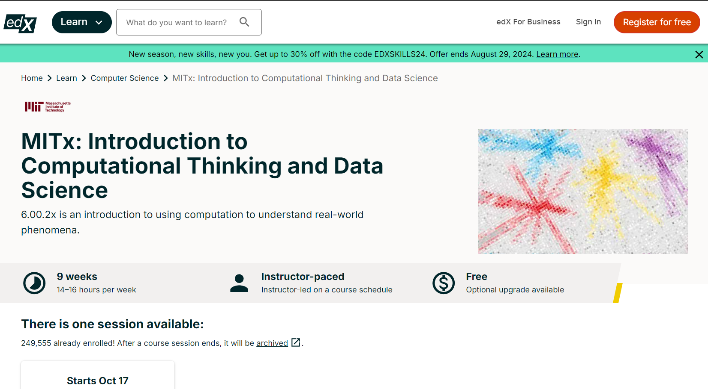
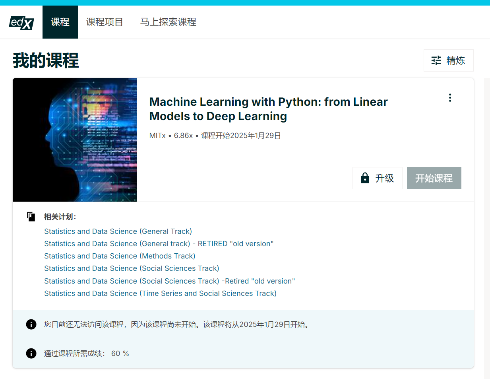

# 计算机知识学习

## MIT免费课程

### [MITx: Introduction to Computational Thinking and Data Science](https://www.edx.org/learn/computer-science/massachusetts-institute-of-technology-introduction-to-computational-thinking-and-data-science?index=product_value_experiment_a&queryID=b2c2e9283643f3c30529b34d69556b9c&position=9)

### [MITx: Machine Learning with Python: from Linear Models to Deep Learning](https://www.edx.org/learn/machine-learning/massachusetts-institute-of-technology-machine-learning-with-python-from-linear-models-to-deep-learning)

## 程序化思维

程序化思维（Computational Thinking）是指一种解决问题的思维方式，通过将复杂问题分解为可执行的步骤，用计算机或算法来解决。该思维方式在计算机科学领域具有广泛应用，但同样适用于其他学科和领域。以下是一些关于程序化思维的理论书籍，涵盖了从基础到进阶的内容：

1. **《计算的本质》 - Christos H. Papadimitriou**    该书介绍了计算理论的基础，包括算法、计算模型和复杂性理论，是理解程序化思维的重要参考。

2. **《计算思维：重新理解计算机的力量》 - Jeannette M. Wing**    Jeannette Wing 是提出“计算思维”这一概念的先驱，她的论文和相关著作对于理解程序化思维的核心思想具有重要影响。这本书详细阐述了计算思维在各个领域的应用。

3. **《算法设计与分析》 - Jon Kleinberg, Éva Tardos**    这本书为程序化思维提供了核心基础——算法的设计与分析。算法是程序化思维的核心部分，理解不同算法的运作方式和效率对于培养程序化思维至关重要。

4. **《算法导论》 - Thomas H. Cormen, Charles E. Leiserson, Ronald L. Rivest, Clifford Stein**    这本经典的教材广泛用于计算机科学教育，涵盖了基础和高级的算法内容，适合深入了解如何通过程序化思维解决各种复杂问题。

5. **《计算机程序的构造和解释》 - Harold Abelson, Gerald Jay Sussman**    这是麻省理工学院(MIT)的一本经典教材，强调了程序设计的基本思想，使用Lisp语言来介绍递归、抽象、模块化等编程和思维模式。

6. **《The Pragmatic Programmer》 - Andrew Hunt, David Thomas**    这本书并不仅仅讲编程，它的核心是培养开发者如何以计算化思维的方式去思考问题和解决问题，同时提供了大量实践建议。

7. **《计算机科学中的思维：从算法到代码》 - David Ginat**    该书介绍了如何通过程序化思维解决计算机科学中的问题，尤其是基于算法的思维框架，适合入门和进阶读者。

8. **《Grokking Algorithms: An Illustrated Guide for Programmers and Other Curious People》 - Aditya Bhargava**    该书以简明、直观的方式介绍了常见的算法，强调如何通过程序化思维来设计解决方案，适合初学者阅读。

9. **《模式识别与机器学习》 - Christopher M. Bishop**    本书虽然主要面向机器学习领域，但它通过大量基于算法和统计的方法展示了如何使用程序化思维来理解和解决复杂问题。

10. **《程序员修炼之道》 - Andrew Hunt, David Thomas**    该书强调了编程和思考模式，培养程序员在面对复杂问题时的思维方式，以及如何有效组织代码。

11. **《Clean Code: A Handbook of Agile Software Craftsmanship》 - Robert C. Martin**    本书着眼于代码的质量和设计，通过编写“干净”的代码来增强程序化思维的逻辑性和简洁性。

12. **《The Art of Computer Programming》 - Donald Knuth**    Donald Knuth的经典巨著，系统讲解了各种算法和数据结构，适合对程序化思维有深入兴趣的人。

13. **《Programming Pearls》 - Jon Bentley**    这是一本经典的书，介绍了很多编程技巧和思维方式，强调如何用简单、优雅的算法来解决复杂的问题。

这些书籍从不同层面（算法、程序设计、复杂性理论、思维方式等）帮助你培养和深化程序化思维，适合从初学者到高级开发者或研究人员。
