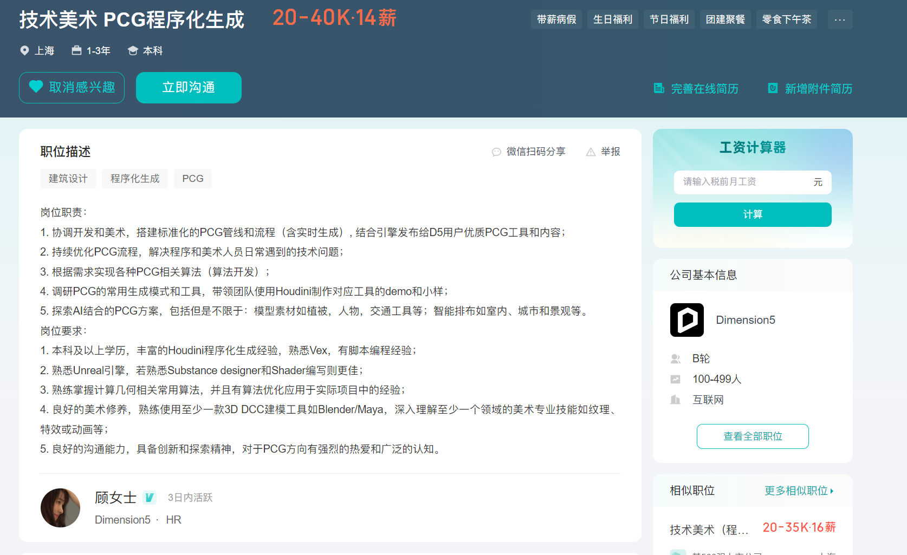
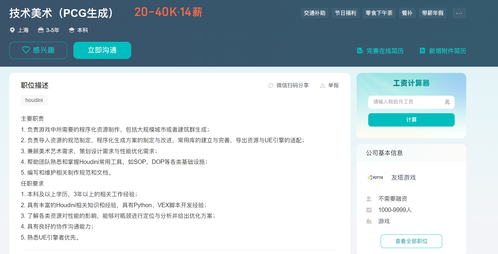
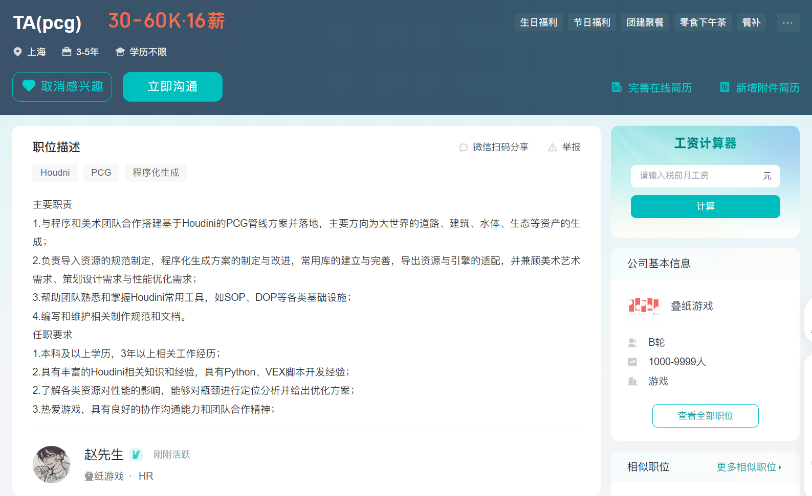
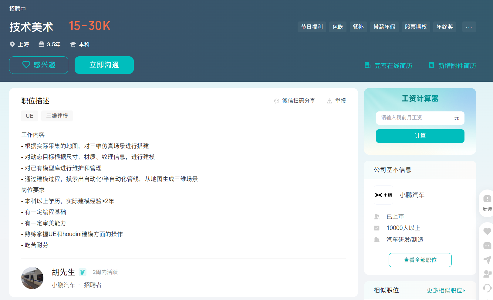
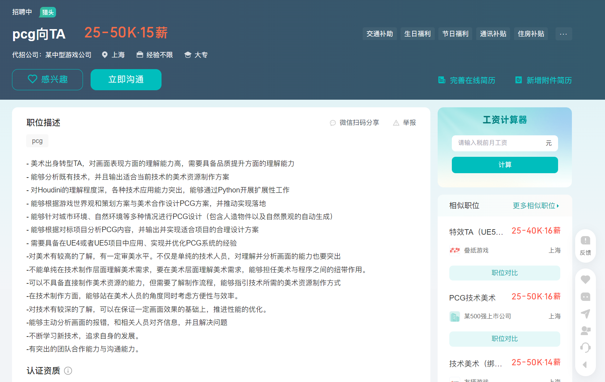

# 招聘技术栈梳理

## 程序化建模

### D5

#### 友塔

- 分支主题 7
  
  - 分支主题 5
    
    - 分支主题 6
      
### 工作需求

#### 程序化建模目的

- 大场景，植物散布，不同体量建筑组合
- PCG工具
- UE-HDA
#### 游戏流程

- houdini找工作，上海游戏TA 友塔：PDG，场景性能优化，TA写工具给美术使用，合作性 网易：漫威争锋，破损效果 叠纸：程序化地形
- 叠纸pcg开发
- 地形资产散布
- 模块化建筑
  - 高低模
  - 烘焙贴图
  - 模块化组装
  - UE5PCG
#### D5需求

- 素材生成
  - 石头，植物，路灯，桥梁
- 智能排布
  - 景观，城市，室内
### 作品集

#### UEpcg

- 植被组团
- 工厂单体建筑
- 山体，悬崖
#### houdini地形

#### houdini建筑

- 基础形体模块分色
- 屋顶生成
- 破碎效果
- 立面图表
- PDG流程
#### houdini工具

- 藤蔓
- 桥梁
- 悬崖
#### 诺亚城市

- 场地划分
- 建筑体量容积率调整
#### PCG应用报告

- houdini与UE的优缺点
#### 原文件翻译，精简

### 能力匹配

#### houdini项目案例

- 建筑
  - 游戏欧式
  - 古建
- 城市
- 小物件
- VEX
#### 多年参数化设计经验

- GH学习案例
  - 程序化地形
  - 竹里建筑屋顶结构
  - kangaroo力学模拟
  - rhinoscript
- 参数化古建筑
- python基础
- 墨尔本大学作品集
#### 诺亚智能设计

- 定容城市
- 自动立面生成
### 根据招聘需求制作案例demo及过程解析

#### ue大鸟瞰 Houdini识别地块范围 植物散布 扣除场地内建筑  方形地块 游戏影视特殊形状地块

### 封装工具组合，给美术使用，可以多次编辑，制作某个元素的组件，整体通过UE中人为编辑组合，保证每个环节可以人工进行单独学习编辑
