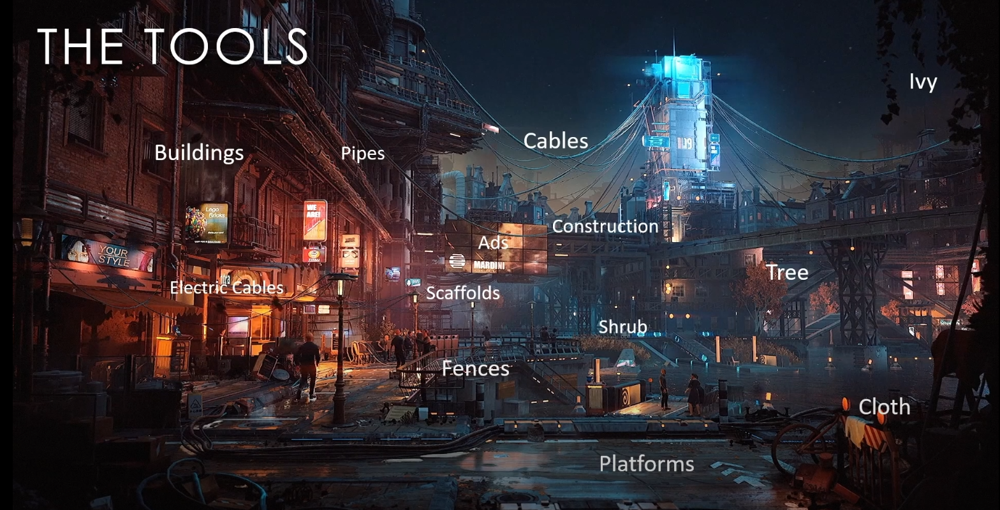
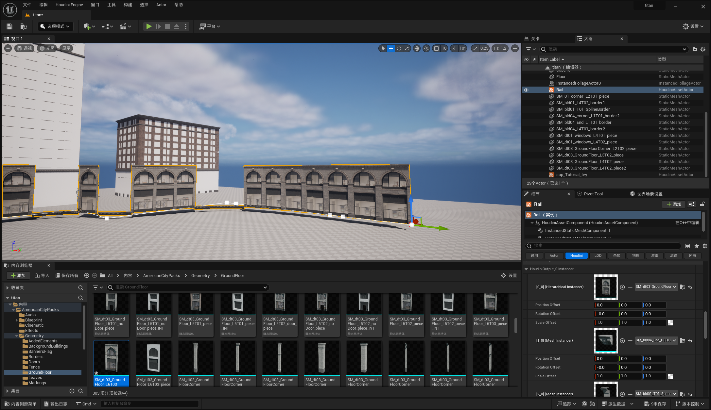
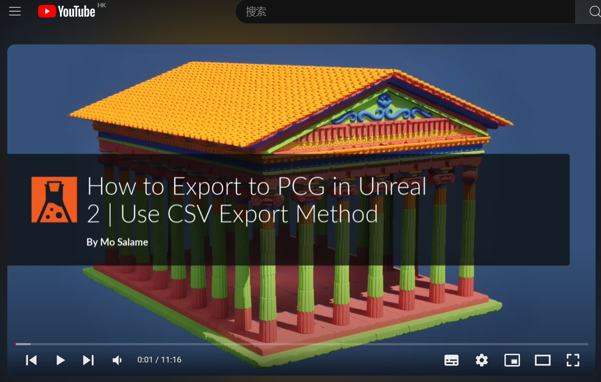

# 官方课程

## 官方课程，非常重要

### UE素材，quixel

### UE-HDA

#### [官方HDA to UE](https://www.youtube.com/watch?v=WjdgHCAgrBM&list=PLXNFA1EysfYkc2-O6qaQj5t0Km9W8CjEl)

### [simon官网链接](https://www.sidefx.com/tutorials/author/Simon_V/)

### 城市生成

#### [City Building with OSM Data](https://www.youtube.com/watch?v=FQ_DKhSyelY&list=PLXNFA1EysfYkFzKS--S3_3393X2z1F_e0&index=1)

#### [单体建筑模块组装](https://www.youtube.com/watch?v=3iWCje_uCZ8&list=PLXNFA1EysfYl_JM9Dgs0gpo394YhLEeZ2&index=1)

#### [Procedural Everything 程序化全世界](https://www.youtube.com/watch?v=xy6dewe8XBw)

#### [PDG](https://www.bilibili.com/video/BV15b411Z7AV/?spm_id_from=333.1387.favlist.content.click&vd_source=089349bc15fe4a0508fc235b6d5563a8)

### TITAN系列课程

#### [B站整理链接新](https://www.bilibili.com/video/BV1om421K7aA/?spm_id_from=333.337.search-card.all.click&vd_source=089349bc15fe4a0508fc235b6d5563a8)

#### [单体建筑模块组装，需要lab](https://www.youtube.com/watch?v=3iWCje_uCZ8&list=PLXNFA1EysfYl_JM9Dgs0gpo394YhLEeZ2&index=1)

#### [轨道](https://www.youtube.com/watch?v=6zrkdKVKxKA&list=PLXNFA1EysfYn8ShNoLy2PxSuYSelBmonJ&index=2)

- 曲线处理
- 只输出点，直接用ue中的模型进行替换
- instance attribute
  - 模型替换
    
  - 轴心方向
#### [藤蔓](https://www.youtube.com/watch?v=2NiV3EyK5xc&list=PLXNFA1EysfYkjtSoBdZ53TgBIGjMlFDga)

#### [平台](https://www.youtube.com/watch?v=VADV0EATGEs&list=PLXNFA1EysfYmHl-KbCpI0mq6IJes_3Taz)

#### [栏杆](https://www.youtube.com/watch?v=u354e9rXMIM&list=PLXNFA1EysfYkQYx4WxwVh7DHEuuSJHZVY)

#### [散布盒子](https://www.youtube.com/watch?v=576i3Qve9-w&list=PLXNFA1EysfYm0MPSArwg-Kdnb1fWyat1K&index=2)

#### [布料解算](https://www.youtube.com/watch?v=4NwrYWt5GVA&list=PLXNFA1EysfYn-oR0wFe5bBk1ZKoRfjt_j)

#### [列车碰撞特效](https://www.youtube.com/watch?v=3DVOZYn866s&list=PLXNFA1EysfYkQeOKNeETuaiR3zw7sFFLE)

#### [揽绳](https://www.youtube.com/watch?v=QFeLnnMnLxo&list=PLXNFA1EysfYnkP5GncdwIVsZABbZ2z_Ud)

#### 管道

#### 场景组合渲染？

### [Post Apocalyptic Ruins | INTRODUCTION](https://www.youtube.com/watch?v=U9lIY94HxrU&list=PLXNFA1EysfYkqx3R-WyQHYEYR3c1odJPX)

#### [小建筑](https://www.youtube.com/watch?v=PfcbekTodWw&list=PLXNFA1EysfYkqx3R-WyQHYEYR3c1odJPX&index=9)

#### 地形

#### 道路，轨道

#### 石头堆

### [官方to UE pcg](https://www.youtube.com/watch?v=4LDVt2RBywU&list=PLXNFA1EysfYmttAEPvIlJDWGgTRhx0OFS&index=1)

### [大型贫民窟塔楼官网链接](https://www.sidefx.com/tutorials/favela-dystopia-creating-vast-environments/)

### 招聘要求的技术栈

#### 友塔：

- 城市建筑
- TA写工具给美术使用，合作性
- PDG，场景性能优化，
#### 叠纸：

- 自然地形
### 刺客信条地图技术点
