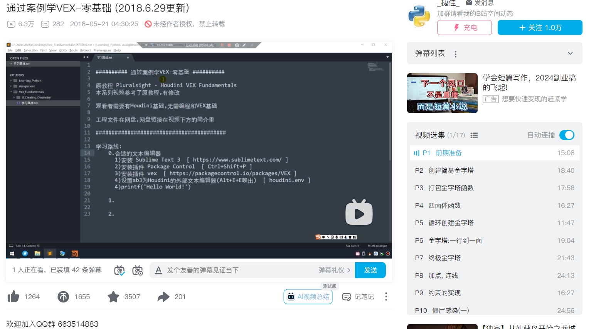
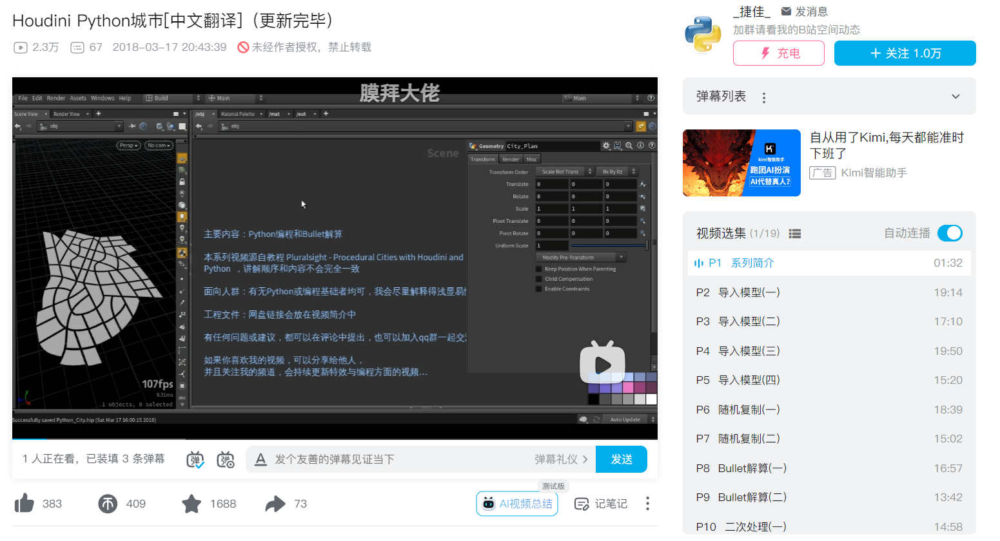
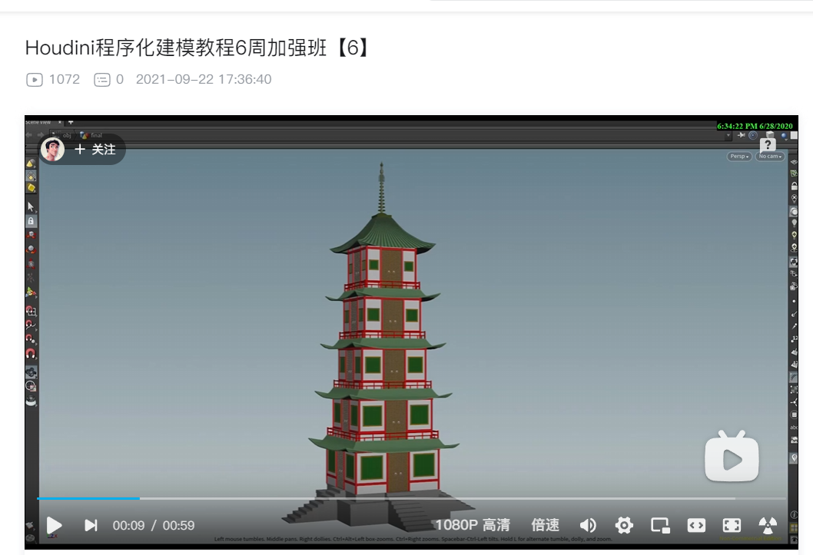
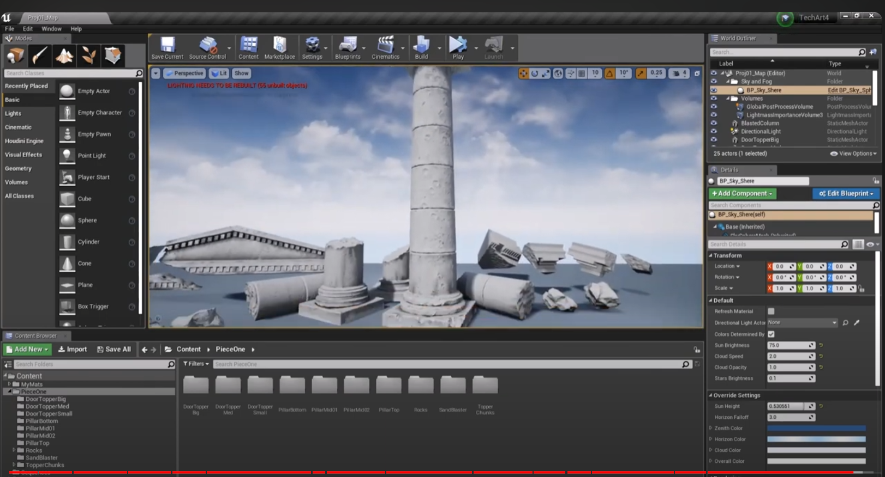

# 框架整理

## 知识框架

### 商业应用，工作导向

#### 影视

#### 游戏

#### 数字孪生

### 程序化思维

### 主要模块

#### 场景（Scene） — 对象 — OBJ

#### 几何（Geometry） — 曲面运算操作 — SOP

#### Solaris — 照明/布局操作 — LOP

#### 材料（Materials） — VEX Builder —- MAT

#### Motion FX — 通道操作 — CHOP

#### VEX — VEX Builder — VOP

#### 输出（Outputs） — 渲染操作 — ROP

#### 任务（Tasks） — 任务操作 — TOP

#### 动力学（Dynamics） — 动态算子 — DOP

#### 合成（Compositing） — 合成操作 — COP/IMG

#### 主要

- SOP
  - 几何体编辑
- VOP
  - 可视编程
- DOP
  - 解算
- VEX
- Python
#### SideFX Labs

- Pivot Painter：用于控制几何体的位置和旋转信息。 Building Generator：用于从基础几何体生成详细的建筑模型。 Cable Generator：用于创建和模拟电缆。 Edge Smooth：用于平滑模型边缘。
### 网站整理

#### [Houdini Foundations,中文翻译书籍，不完全](https://houdini-foundations.readthedocs.io/zh-cn/latest/views/overview/index.html)

#### 官方节点文档案例

#### 国内

- [VFX FORCE，国内整理，各类CG资源](https://www.vfxforce.cn/)
  - [岩石生成](https://www.vfxforce.cn/archives/8980)
    - [海洋](https://www.vfxforce.cn/archives/15178)
- [about cg](https://www.aboutcg.org/)
- [特效向](https://iiivfx.com/archives/tag/mianfei)
#### [CGCircuit: 这是一个专门提供Houdini课程的网站，需要买课程](https://www.cgcircuit.com/)

#### [影视特效学习网站，免费工程文件](https://www.rebelway.net/learn)

### 入门课程

#### 程序化建模思维

- 建模
  - 移动，旋转，缩放，阵列
  - 倒角，放样
  - 挤出厚度
  - 模块化思维（组件）
    - 复制到点
  - group node
- 程序化
  - 数据运算
    - 循环语句
  - 噪波
  - 算法
    - 三维波函数坍塌算法
#### [houdini666](https://www.bilibili.com/video/BV1CJ4m1P71W/?p=2&spm_id_from=pageDriver&vd_source=089349bc15fe4a0508fc235b6d5563a8)

- 总结案例，地形，植物散布
#### [Houdini建模教程合集](https://www.bilibili.com/video/BV1rr4y1N7jA/?spm_id_from=333.999.0.0&vd_source=089349bc15fe4a0508fc235b6d5563a8)

### 建模案例

#### [程序化资产，链条制作](https://www.youtube.com/watch?v=ybk8XWBnO4o&list=PLXNFA1EysfYnnm2-UZmxrd-MWC7LTWEVl)

- 打包asset工具
#### [石墩资产制作](https://www.aboutcg.org/play?courseId=2210&lessonId=124946)

#### [拆UV](https://www.bilibili.com/video/av29821314/?from=search&seid=17529637945471838184&vd_source=089349bc15fe4a0508fc235b6d5563a8)

### [HOUDINI KITCHEN](https://www.houdinikitchen.net/)

### 官方课程，官网分类细致

#### UE-HDA

- [官方HDA to UE](https://www.youtube.com/watch?v=WjdgHCAgrBM&list=PLXNFA1EysfYkc2-O6qaQj5t0Km9W8CjEl)
- [houdini UE联动，批量复制，动力学解算](https://www.bilibili.com/video/BV1LU4y1U7Xs/?spm_id_from=333.337.search-card.all.click&vd_source=089349bc15fe4a0508fc235b6d5563a8)
- 在UE中调整参数
#### [simon官网链接](https://www.sidefx.com/tutorials/author/Simon_V/)

#### TITAN系列课程

- [B站整理链接新](https://www.bilibili.com/video/BV1om421K7aA/?spm_id_from=333.337.search-card.all.click&vd_source=089349bc15fe4a0508fc235b6d5563a8)
  - [B站整理链接](https://www.bilibili.com/video/BV1yL4y1x7yz/?spm_id_from=333.999.0.0&vd_source=089349bc15fe4a0508fc235b6d5563a8)
- [藤蔓](https://www.youtube.com/watch?v=2NiV3EyK5xc&list=PLXNFA1EysfYkjtSoBdZ53TgBIGjMlFDga)
  - 过程解析截图展示
- [单体建筑模块组装，需要lab](https://www.youtube.com/watch?v=3iWCje_uCZ8&list=PLXNFA1EysfYl_JM9Dgs0gpo394YhLEeZ2&index=1)
- [轨道](https://www.youtube.com/watch?v=6zrkdKVKxKA&list=PLXNFA1EysfYn8ShNoLy2PxSuYSelBmonJ&index=2)
- [栏杆](https://www.youtube.com/watch?v=u354e9rXMIM&list=PLXNFA1EysfYkQYx4WxwVh7DHEuuSJHZVY)
- [散布盒子](https://www.youtube.com/watch?v=576i3Qve9-w&list=PLXNFA1EysfYm0MPSArwg-Kdnb1fWyat1K&index=2)
- [平台](https://www.youtube.com/watch?v=VADV0EATGEs&list=PLXNFA1EysfYmHl-KbCpI0mq6IJes_3Taz)
- [布料解算](https://www.youtube.com/watch?v=4NwrYWt5GVA&list=PLXNFA1EysfYn-oR0wFe5bBk1ZKoRfjt_j)
- [列车碰撞特效](https://www.youtube.com/watch?v=3DVOZYn866s&list=PLXNFA1EysfYkQeOKNeETuaiR3zw7sFFLE)
- [揽绳](https://www.youtube.com/watch?v=QFeLnnMnLxo&list=PLXNFA1EysfYnkP5GncdwIVsZABbZ2z_Ud)
- 管道
- 场景组合渲染？
#### [Post Apocalyptic Ruins | INTRODUCTION](https://www.youtube.com/watch?v=U9lIY94HxrU&list=PLXNFA1EysfYkqx3R-WyQHYEYR3c1odJPX)

- [建筑](https://www.youtube.com/watch?v=PfcbekTodWw&list=PLXNFA1EysfYkqx3R-WyQHYEYR3c1odJPX&index=9)
- 地形
- 道路，轨道
- 石头堆
#### [大型贫民窟塔楼官网链接](https://www.sidefx.com/tutorials/favela-dystopia-creating-vast-environments/)

#### 破碎特效

- [小建筑](https://www.sidefx.com/tutorials/building-destruction-rbd-bullet-solver/)
#### [官方to UE pcg](https://www.youtube.com/watch?v=4LDVt2RBywU&list=PLXNFA1EysfYmttAEPvIlJDWGgTRhx0OFS&index=1)

### 案例展示

#### [程序化建筑](https://www.bilibili.com/video/BV1vW4y1U7Ly/?vd_source=089349bc15fe4a0508fc235b6d5563a8)

### VEX，Python

#### GPT辅助节点设计以及VEX

#### [入门中文教程，有工程文件](https://www.bilibili.com/video/BV1Zp411d7Hw/?spm_id_from=333.999.0.0&vd_source=089349bc15fe4a0508fc235b6d5563a8)

#### [Houdini Python城市[中文翻译]](https://www.bilibili.com/video/av20882458/?vd_source=089349bc15fe4a0508fc235b6d5563a8)

#### 湖边小屋

- [中文拆解教程](https://www.bilibili.com/video/BV1Ly4y1i7Vx/?spm_id_from=333.999.0.0&vd_source=089349bc15fe4a0508fc235b6d5563a8)
- [付费课程](https://www.aboutcg.org/courseDetails/2103/introduce)
- [【教程解析】up肝完Houdini经典教程《湖边小屋》，来分析并拆解它的步骤](https://www.bilibili.com/video/BV14E411v71V?spm_id_from=333.788.videopod.episodes&vd_source=089349bc15fe4a0508fc235b6d5563a8)
### 古建筑

#### [塔](https://www.bilibili.com/video/BV1bh411n77F/?spm_id_from=333.999.0.0&vd_source=089349bc15fe4a0508fc235b6d5563a8)

### 特效

#### [子主题 1](https://www.youtube.com/watch?v=gfFZc7cCUTE)

#### [碎裂特效](https://www.youtube.com/watch?v=NX_Z3Mgo-IM)
