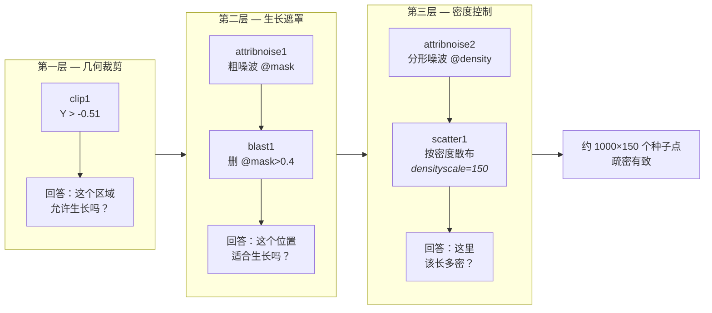
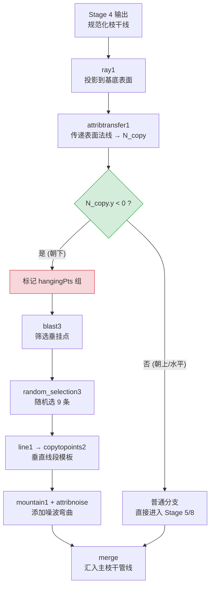
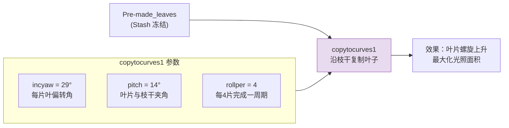
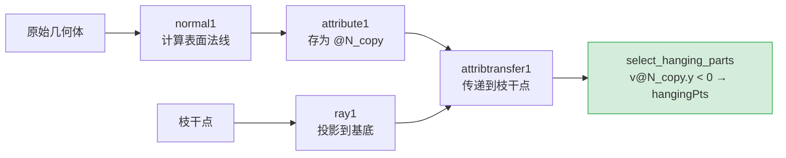

# dd_Ivy 常春藤生成器 — 流程图

> 来源：[[Ivy_技术文档]]
> HDA：`sop/dd_Ivy` | 节点总数：83

---

## 总览流程图

```mermaid
flowchart TD
    A["<b>输入几何体</b><br/>任意表面"] --> B

    subgraph S1["Stage 1 — 重建网格"]
        B["remeshgrid1<br/>重网格化<br/><i>边长=0.055</i>"] --> B2["peak1<br/>微膨胀防穿插"]
    end

    B2 --> C

    subgraph S2["Stage 2 — 散布种子点（三层筛选）"]
        C["<b>第一层</b><br/>clip1 几何裁剪<br/>Y &gt; -0.51"] --> C2["<b>第二层</b><br/>attribnoise1 → blast1<br/>生长遮罩 @mask>0.4 剔除"]
        C2 --> C3["<b>第三层</b><br/>attribnoise2 → scatter1<br/>密度控制 @density<br/><i>densityscale=150</i>"]
    end

    C3 --> D

    subgraph S3["Stage 3 — 生成主体枝干 ⭐核心"]
        D["sort1→grouprange1<br/>排序分组"] --> D2["random_selection1<br/>随机选 beginPts/endPts"]
        D2 --> D3["connectadjacentpieces1<br/>构建图网络<br/><i>半径0.1 锥角90° 每点1连接</i>"]
        D3 --> D4["findshortestpath1<br/>Dijkstra 最短路径<br/><i>multiplicity=2 双路径分叉</i>"]
        D4 --> D5["delete_small_parts1→carve<br/>清理短枝+裁切首尾"]
    end

    D5 --> E

    subgraph S4["Stage 4 — 重建分支线 + 统一方向"]
        E["For-Each 循环<br/><i>按@startpt迭代</i>"] --> E2["resample1→fuse1→polypath1<br/>→resample2→promote→remap<br/>均匀采样+融合+路径化"]
    end

    E2 --> F
    E2 --> G

    subgraph S5["Stage 5 — 次级分支"]
        F["random_selection2<br/>主枝干上随机选附着点"] --> F2["orientalongcurve1<br/>计算曲线方向"]
        F2 --> F3["attribrandomize1<br/>随机化旋转"]
        F3 --> F4["copytopoints1<br/>复制分支曲线模板"]
    end

    subgraph S6["Stage 6 — 筛选垂挂部分"]
        G["ray1 投影到基底"] --> G2["attribtransfer1<br/>传递表面法线 N_copy"]
        G2 --> G3{"<b>N_copy.y &lt; 0 ?</b><br/>法线朝下检测"}
        G3 -->|"是 → hangingPts"| H
        G3 -->|"否"| SKIP["非垂挂点<br/>直接进入合并"]
    end

    subgraph S7["Stage 7 — 垂挂分支"]
        H["blast3<br/>筛选垂挂点"] --> H2["random_selection3<br/>随机选 9 条"]
        H2 --> H3["line1→copytopoints2<br/>垂直线段模板"]
        H3 --> H4["mountain1+attribnoise<br/>添加噪波弯曲"]
    end

    F4 --> MERGE["<b>merge</b><br/>合并所有分支线"]
    H4 --> MERGE
    SKIP --> MERGE

    MERGE --> K

    subgraph S8["Stage 8+9 — 3D化 + 叶子 + 材质"]
        K["<b>枝干 sweep1</b><br/>radius=0.019 cols=8<br/>scaleramp 根粗末细"] --> K2["color1 → connectivity1<br/>→ vertex_colors → unreal_material<br/>棕褐底色+随机绿色调+UE标记"]
        K -.-> K3["<b>叶子粘贴</b><br/>copytocurves1<br/>incyaw=29° pitch=14°<br/>螺旋叶序排列"]
        K3 --> K4["Pre-made_leaves (Stash)<br/>冻结叶子模板"]
        K2 --> OUT
        K4 --> OUT
    end

    OUT["<b>output0</b><br/>最终输出：枝干管+叶子+材质"]

    style S3 fill:#fff3cd,stroke:#ffc107,stroke-width:2px
    style D4 fill:#ffc107,stroke:#e0a800,color:#000
    style G3 fill:#d4edda,stroke:#28a745
    style OUT fill:#cce5ff,stroke:#007bff,stroke-width:2px
```



---

## 三层筛选逻辑



---

## 核心算法：最短路径枝干生成

```mermaid
flowchart TD
    subgraph input["输入"]
        SEED["散布种子点"]
    end

    SEED --> A

    subgraph graph["connectadjacentpieces1 — 构建图网络"]
        A["邻域半径 0.1"] --> B["锥角 90°<br/>限制方向"]
        B --> C["每点最多 1 条连接"]
        C --> D["图网络：<br/>稀疏、有向、无回路"]
    end

    D --> E

    subgraph path["findshortestpath1 — 寻路"]
        E["beginPts → endPts"] --> F["Dijkstra 最短路径"]
        F --> G["multiplicity=2<br/>双路径分叉"]
        G --> H["树状枝干网络<br/>有主干+分支"]
    end

    H --> CLEAN["delete_small_parts1<br/>→ carve<br/>清理+裁切"]

    style graph fill:#e8f4fd,stroke:#2196f3
    style path fill:#fff3cd,stroke:#ffc107
    style H fill:#ffc107,stroke:#e0a800,color:#000
```

---

## 垂挂分支生成逻辑



---

## 叶序螺旋排列



---

## 数据流向：法线传递链



---

## 图例

| 颜色 | 含义 |
|------|------|
| 🟡 黄色 | 核心算法 / 关键步骤 |
| 🟢 绿色 | 决策 / 判断节点 |
| 🔵 蓝色 | 最终输出 |
| 🔴 红色 | 异常/筛选标记 |
| 🟣 紫色 | 叶子相关 |
